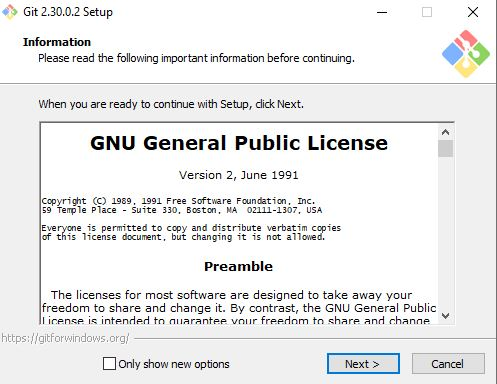
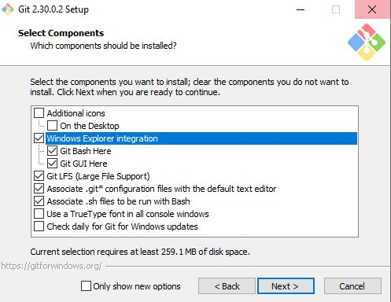
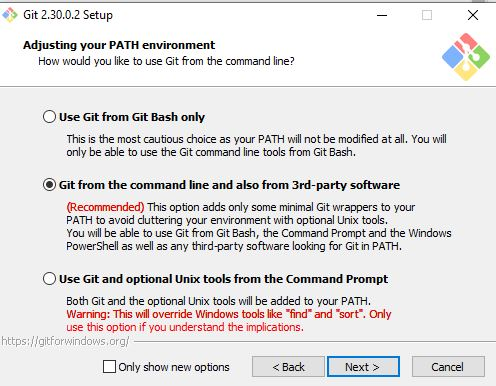
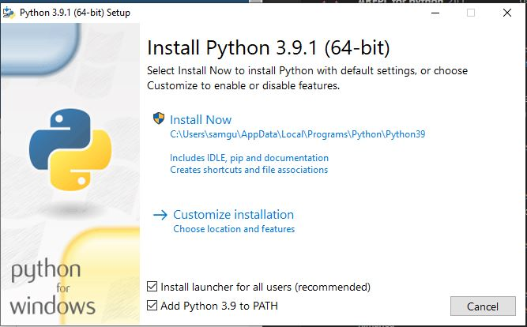
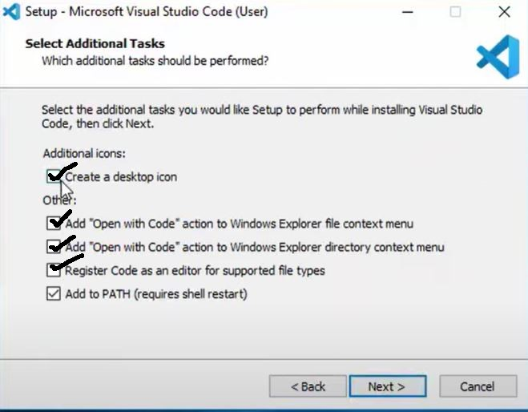
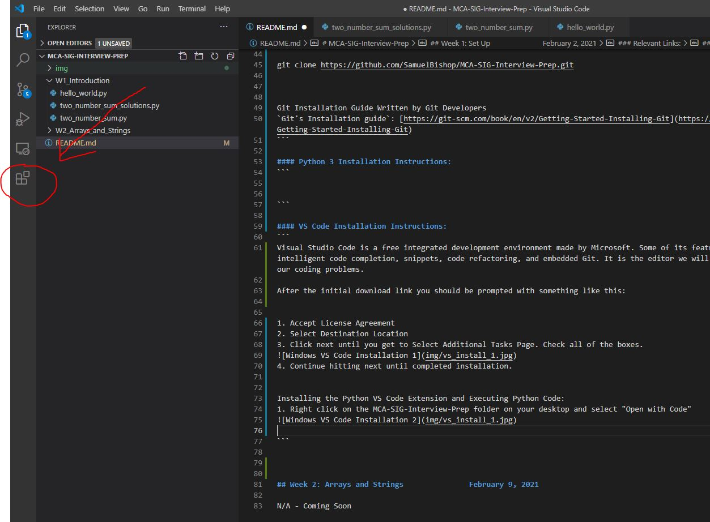
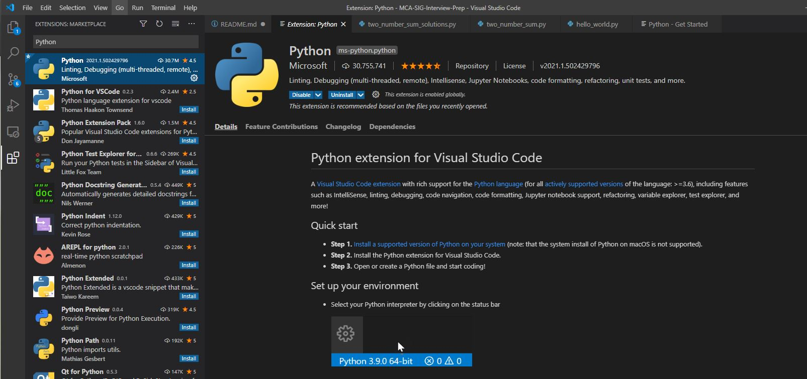

# MCA-SIG-Interview-Prep

This is the repository for use of the `Interview Preparation` `Special Interest Group (SIG)` in collaboration with the `Mizzou Computing Association (MCA)`. Weekly content will be uploaded to this repository throughout the spring semester of 2021. Content will include: instruction, practice problems, interviewing resources, and more. 

```
TIME: 6:00PM, Tuesdays
PLACE: Naka Hall, Room 222
LEADER: Samuel Bishop
```

## Week 1: Set Up                          February 2, 2021
The focus for this week will be to install the `Python 3` programming language, set up the `Visual Studio Code` `Integrated Development Environment (IDE)`, install the Python extension for VS Code, and solve the related coding question(s).
  
### Relevant Links:
`git`: [https://git-scm.com/downloads](https://git-scm.com/downloads)  
`Python 3`: [https://www.python.org/downloads/](https://www.python.org/downloads/)  
`VS Code`: [https://code.visualstudio.com/download](https://code.visualstudio.com/download)  
  
  
### Git Installation Instructions:
Git is a distributed `version control system` used for tracking changes in files and collaborating on coding projects. Git's main goals include speed, data integrity, and support for distributed, non-linear workflows. Version control, especially git, will be something you will run into often coding and this is a good thing to learn early on. If confused, just think of git the coder's version of Google Docs.
  
The installation wizard should look similar to this:  

  
Make sure to have the following checked. You may also create a desktop icon.

  
The following selections you should only need select next:  
+ Use Vim  
+ Let Git Decide  
  

  
The following selections you should only need select next:  
+ Use the OpenSSL library  
+ Checkout Windows-style, commit Unix-style line endings  
+ Use MinTTY  
+ Default set to Git Credential Manager Core  
+ Enable file system caching  
  
Open cmd admin (in macOs it will be terminal)  
git --version  
Navigate to your desktop using:  
+ Windows: dir, cd  
+ MacOs: ls, cd  
  
git clone https://github.com/SamuelBishop/MCA-SIG-Interview-Prep.git  
  
  
  
#### Git Installation Guide Written by Git Developers  
`Git's Installation guide`: [https://git-scm.com/book/en/v2/Getting-Started-Installing-Git](https://git-scm.com/book/en/v2/Getting-Started-Installing-Git)  
  
  
  
  
### Python 3 Installation Instructions:
Python is an interpreted, high-level and general-purpose programming language. Python's design philsophy emphasizes code readbility and is known as one of the best-first coding languages. As well as generally the language of coding interviews.

After running the installer you should do the following:
  
Make sure to elect to Add a PATH variable

Finally, next through the installation process until completion.  
  
  
  
#### VS Code Installation Instructions:
Visual Studio Code is a free integrated development environment made by Microsoft. Some of its features include debugging, syntax highlighting, intelligent code completion, snippets, code refactoring, and embedded Git. It is the editor we will be using in this interest groups to solve our coding problems.  
  
After running the installer should be do the following:
1. Accept License Agreement
2. Select Destination Location
3. Click next until you get to Select Additional Tasks Page. Check all of the boxes.

4. Continue hitting next until completed installation.
  
  
Installing the Python VS Code Extension and Executing Python Code:
1. Right click on the MCA-SIG-Interview-Prep folder on your desktop and select "Open with Code"

2. Search Python in the search box
3. Click the first result. It should be the Python extension created by Microsoft

4. Navigate to the VS Code terminal and change directories to W1_introduction
5. Enter "py hello_world.py" into the terminal
  
  
  
## Week 2: Arrays and Strings               February 9, 2021  
The focus for this week will be to review the most important aspects of the `behavioral interview` including creating accounts on relevant platforms like `LinkedIn` and `GitHub`, giving generalized `resume` tips, providing a sample `cover letter`, working on an `elevator pitch`, and providing an almost comprehensive list of behavioral questions in the form of [Behavioral Questions.txt](https://github.com/SamuelBishop/MCA-SIG-Interview-Prep/blob/main/W2_Arrays_and_Strings/Behavioral%20Questions.txt).  
  
Additionally, we will be addressing the important programming topic of `Big O Notation`, going over its function and usage. Then using the what we've learned about algorithmic runtime we will be applying to basic `array` and `string` problems to get a conceptual grasp as well as acclimatize members to coding interview style problems.  
  
If you are bored with the level of difficulty - don't worry it will ramp up in the later weeks.  
    


### Relevant Links:  
To brush up on python:  
`learnpython.org`: [https://www.learnpython.org/](https://www.learnpython.org/)  
  
Recommended Interview Book:  
`Cracking the Coding Interview (6th Edition) by Gayle Laakmann McDowelll`:  
[https://www.amazon.com/Cracking-Coding-Interview-Programming-Questions/dp/0984782850](https://www.amazon.com/Cracking-Coding-Interview-Programming-Questions/dp/0984782850)
  
Recommended Subscription Service for Coding Problems:  
`AlgoExpert`: [https://www.algoexpert.io/product](https://www.algoexpert.io/product)  
  
  

## Week 3: Recursion, Linked Lists and Hashtables               February 16, 2021  
This week will be taking a closer look at the details of the `coding interview`. We will cover `whiteboarding`, the `google doc`, and the `Web IDE` styles. We will also talk about how to build up projects on a resume even as a underclassman by attending `hackathons`, contributing to `open source` projects, and going over some common technologies to look into in various project areas. 
  
Our programming topics section today will be the majority of the disccusion and will include  `Recursion`, `Linked Lists`, and `Hash Tables (~ Hash Maps)`. Throughout the examples we will use what we've learned about those programming concepts and apply this knowledge to at least one sample problem per topic.  
  
Additionally, the virtual career fair is next Wednesday. The SIG will be surveyed today to see if they would like to do informal mock interviews during next week's meeting.  
    
  
  
### Relevant Links:  
Data Structures - Hash Tables (Gayle Laakmann McDowell):  
`YouTube Video`: [https://www.youtube.com/watch?v=shs0KM3wKv8&t=307s](https://www.youtube.com/watch?v=shs0KM3wKv8&t=307s)
  
  
  
## Week 4: Stacks and Queues               March 2, 2021  
This week we will be looking at some of the different occupations (not cumlative) that one can have with Computer Science/Information Technologies/Computer Engineering education. Theses occupations include:  
`Web Development`:  
+ `Front End Dev`  
+ `Back End Dev`  
+ `Database Engineer`  
+ `Full Stack Engineer`  
  
`Mobile Development`:  
+ `iOS Dev`  
+ `Android Dev`  
+ `Cross Platform Dev`  
  
`Desktop Applications Development`:  
+ `Game Design`  
  
`Data Science`:  
+ `Quantitative Analyst (Quant)`  
  
`Hardware`:  
+ `Electrical Engineer`  
+ `Design Engineer`  
+ `Computer Architect`  
+ `Firmware/Embedded Engineer`  
  
`Product Management (PM)`:  
+ `Product Manager`  
  
Our programming section today briefly covers the `stacks` and `queue` data structures. Potentially and example will be given. But more likely, you should work on these algoexpert practice problems by yourself:  
- Balanced Brackets (was personally asked this at MS)  
- Queue Construction (will only be ever asked to construct one)  
- Extra: Cracking the coding interview problems 3.1-3.6  
  

  
### Relevant Links:  
Stack in Python:  
`geeksforgeeks article`: [https://www.geeksforgeeks.org/stack-in-python/](https://www.geeksforgeeks.org/stack-in-python/)  
Queue in Python:   
`geeksforgeeks article`: [https://www.geeksforgeeks.org/queue-in-python/](https://www.geeksforgeeks.org/queue-in-python/) 
Cracking the Coding Interview PDF - (Gayle Laakmann McDowell):  
`PDF`: [https://cin.ufpe.br/~fbma/Crack/Cracking%20the%20Coding%20Interview%20189%20Programming%20Questions%20and%20Solutions.pdf](https://cin.ufpe.br/~fbma/Crack/Cracking%20the%20Coding%20Interview%20189%20Programming%20Questions%20and%20Solutions.pdf)